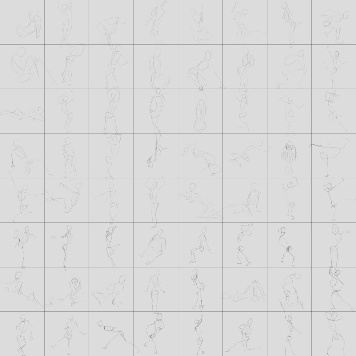

Exercise grids templates for Krita
==================================

Exercise grids to use with the open-source digital painting software Krita.   
License : CC-0 /public domain.

Use them with Figure & Gesture Drawing websites to train your drawing skills, like 
http://artists.pixelovely.com/ or http://www.posemaniacs.com/

An explanation video by Matt Kohr [here](http://www.ctrlpaint.com/videos/quick-pose-gesture-sketching).

##Installation

To install them,  unzip, and paste the folder ( templates ) into your Krita user preference directory ( example on linux : ~/.kde4/share/apps/krita/ )
You can also open your preference directory inside Krita : Edit > Ressources > Open Resources Folder , don't forget to restart Krita after.

##How to
Those templates are very simple : one is an 8192x8192px image which gives you 64 1024x1024px slots for drawing (or 64 poses during 1 minutes ), and one is a 4096x4096px image which gives you 16 1024x1024px slots for a shorter session, or to work with a less powerful computer.

How to use : pick a pen brush (or another brush you want to practice with), zoom to the first slot, start a drawing session on one of those websites : http://artists.pixelovely.com/ or http://www.posemaniacs.com/, and stop when the session is finished or when every slot is filled. You can draw out of the lines ;)

